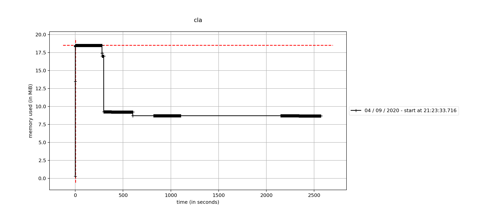

=====================
Combined Log Analyzer
=====================

Receives Apache http server log from standard input and parses the log.
The number of accesses for each host name and the number of accesses for each time are output to standard output as a result.
We supply the target period and time zone with option arguments.

Installation
============

use poetry::

    $ git clone https://github.com/uchida-kei/combined_log_analyzer.git
    $ cd combined_log_analyzer
    $ poetry install --no-dev
    $ poetry shell

Usage
=====
Receives a file on standard input::

    $ cla < LOGFILE

When inputting multiple files
:::::::::::::::::::::::::::::
::

    $ cat LOGFIEL1 LOGFIEL2 LOGFIEL3 | cla

When summarizing by specifying a period
:::::::::::::::::::::::::::::::::::::::
The date format must be an ISO 8601 extension::

    $ cla --from STARTDATE --to ENDDATE < LOGFILE

Performance
===========

Measure memory usage when inputting 10GB log file using memory_profiler.

